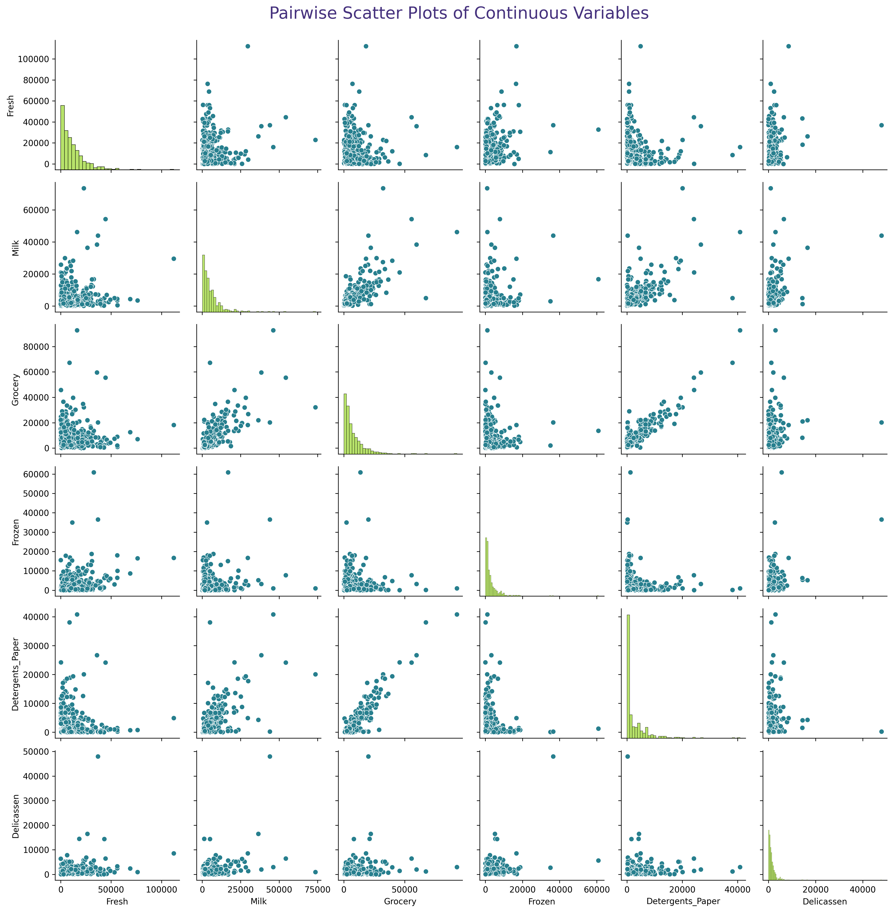
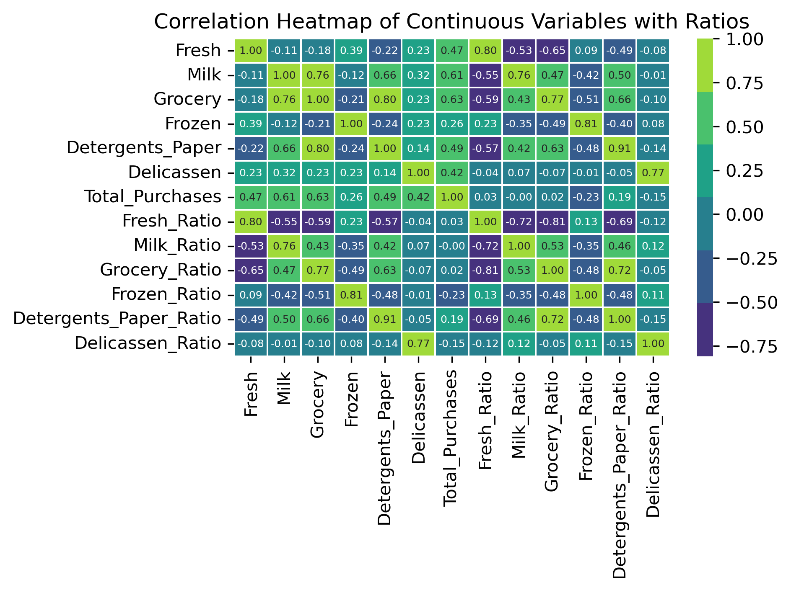

# Machine Learning Project Unsupervised Learning

## Project Outcomes
Unsupervised Learning: perform unsupervised learning techniques on a wholesale data dataset.

The project involves four main parts: exploratory data analysis and pre-processing, KMeans clustering, hierarchical clustering, and PCA.

## Duration:
Approximately 1 hour and 40 minutes

### File Structure:
# CHECK !!!

## Project Description:
In this project, we will apply unsupervised learning techniques to a real-world data set and use data visualization tools to communicate the insights gained from the analysis.

The data set for this project is the "Wholesale Data" dataset containing information about various products sold by a grocery store.
The project will involve the following tasks:

- Exploratory data analysis and pre-processing:
We will import and clean the data sets, analyze and visualize the relationships between the different variables, handle missing values and outliers, and perform feature engineering as needed.

-	Unsupervised learning:
We will use the Wholesale Data dataset to perform k-means clustering, hierarchical clustering, and principal component analysis (PCA) to identify patterns and group similar data points together. We will determine the optimal number of clusters and communicate the insights gained through data visualization.

The **ultimate goal of the project** is to <u>gain insights from the data sets and communicate these insights to stakeholders</u> using appropriate visualizations and metrics to make informed decisions based on the business questions asked.

 

## Process
# CHECK !!!
### Part I : EDA - Exploratory Data Analysis & Pre-processing
1. I found no null values or duplicates.
2. The min values of the continuous columns seem extremely low compared to its max. There may be outliers, and as shown below, the data is right-skewed.

    > 

3. The columns were checked for skewness and were transformed.

    > 

3. **Grocery** purchasing appear to be positively correlated to **Detergents_Paper** and  **Milk** purchases.

    > 

4. For outliers, I removed rows that had multiple outliers (>1) and implemented a cap for min-max values.
    > 

5. Verified the suspected correlations using a heatmap. These correlations shown, although slightly less compared to before the outliers were removed, are still present.

    > 

6. For feature selection, I added a few new columns `Total_Purchases`, and Purchase Ratios for each continuous variable. The pairwise plot (if you want to see,) is in the [notebook](/Projects/ang-lhl-ml-project-unsupervised-learning/Unsupervised%20Learning%20-%20Project.ipynb). The correlation heatmap is shown below.
    > 

 

### Part II - KMeans Clustering
Used the Elbow method to identify the most optimal k: **2**

>    
 

### Part III - Hierarchical Clustering 
I used **ward** method and **euclidean** distance. It appears that there's 2 main clusters, but I decided, maybe it could be 4. And so, I clustered the data using distance threshold of **20**.

>   
 

### Part IV - PCA
I initially added 7 more features, and looking at this chart below (along with inspecting the explained and cumulative variance)... It didn't add that much after all.

>   

 

# Summary: