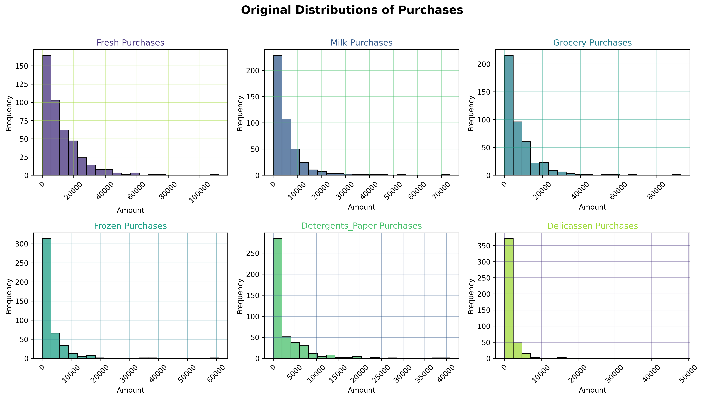
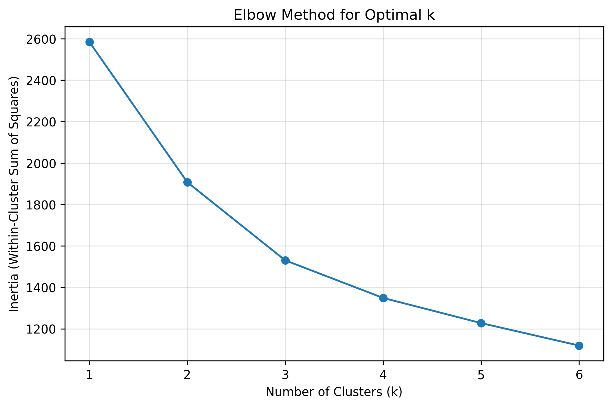
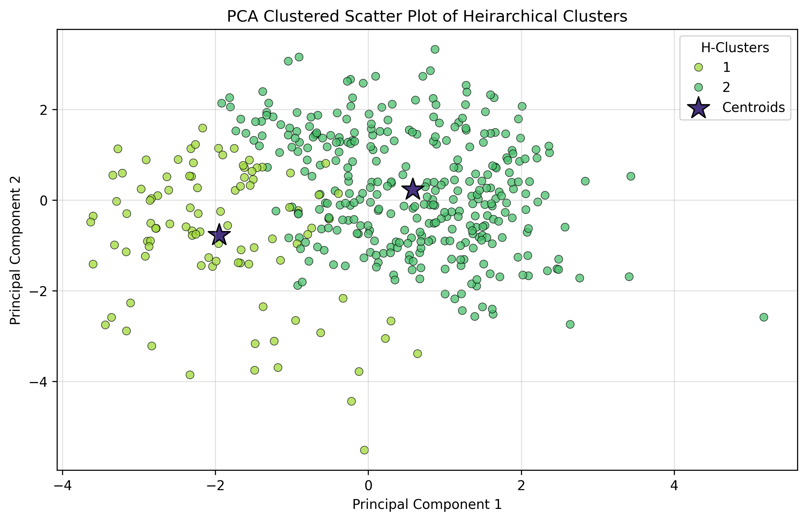

# Machine Learning Project Unsupervised Learning

## Project Outcomes
Unsupervised Learning: perform unsupervised learning techniques on a wholesale data dataset.

The project involves four main parts: exploratory data analysis and pre-processing, KMeans clustering, hierarchical clustering, and PCA.

## Project Description:
In this project, we will apply unsupervised learning techniques to a real-world data set and use data visualization tools to communicate the insights gained from the analysis.

The data set for this project is the "Wholesale Data" dataset containing information about various products sold by a grocery store.
The project will involve the following tasks:

- Exploratory data analysis and pre-processing:
We will import and clean the data sets, analyze and visualize the relationships between the different variables, handle missing values and outliers, and perform feature engineering as needed.

-	Unsupervised learning:
We will use the Wholesale Data dataset to perform k-means clustering, hierarchical clustering, and principal component analysis (PCA) to identify patterns and group similar data points together. We will determine the optimal number of clusters and communicate the insights gained through data visualization.

The **ultimate goal of the project** is to <u>gain insights from the data sets and communicate these insights to stakeholders</u> using appropriate visualizations and metrics to make informed decisions based on the business questions asked.

<br>

### Repo's File Structure:
```
├── data
│   ├── processed
│   │   ├── final
│   │   │   ├── processed_data.csv
│   │   │   ├── processed_nums.csv
│   │   ├── semi-processed_data.csv
│   │   ├── semi-processed_nums.csv
│   ├── Wholesale_Data.csv
├── etc
│   ├── Final Project - Description - UnsupervisedLearning.docx
│   ├── Final Project Rubric - Machine Learning.xlsx
├── images
│   ├── // Image files are here //
├── README.md
├── Unsupervised Learning - Project.ipynb
├── functions.py
```


## Process
### Part I : EDA - Exploratory Data Analysis & Pre-processing
1. I found no null values or duplicates.
2. The nominal features (Channel and Region) were converted to `int8`. The rest of the features (continuous) remained `int64`. This allowed for easier segmentation of data as I could just select *int64/float64* and I know I have all the continuous variables I need.
3. The min values of the continuous columns seem extremely low compared to its max. There may be outliers, and as shown below, the data is right-skewed.

    > 

4. The columns were checked for skewness and were log transformed. Below, is the new distribution.

    > 

5. **Grocery** purchasing appear to be positively correlated to **Detergents_Paper** and  **Milk** purchases. You can check out the original correlation heatmap [here](/images/Correlation_Heatmap.png).

    > 

6. For outliers, I removed rows that had multiple outliers (> 1 per row) and implemented a cap for min-max values for the rest of the outliers:

    > 

7. Verified the suspected correlations using a heatmap. These correlations shown, although slightly less compared to [before](/images/Correlation_Heatmap.png) the outliers were removed, are still present.

    > 

8. For feature selection, I initially added a few new columns `Total_Purchases`, and Purchase Ratios for each continuous variable. The pairwise plot (if you want to see,) is [here](./images/Pairwise_Scatter_Plots_NEW.png). The old correlation heatmap is shown below.
    > 

9. I decided to remove such features and merged Grocery with Detergents_Paper instead. It's now called `Household_Items`. The new correlation heatmap is shown below.
    > 

10. The data was checked for skewness and **log transformation** was applied.

11. Since we're using distance-based models which are sensitive to values of different scales... I used `StandardScaler` to standardize the data.

<br>

### Part II - KMeans Clustering
1. Used the Elbow method to identify the most optimal k: **2**

    > 

2. Used Silhouette Score to validate cluster quality. There's a second spike at 7, but 2 seemed the most optimal.
    
    > 

3. We've identified 2 clusters. Below are the distributions per Channel and Region.
    > 
    > 


<br>

### Part III - Hierarchical Clustering 
1. I used **ward** method and **euclidean** distance. It appears that there's 2 main clusters, but I decided, maybe it could be 3. And so, I clustered the data using a distance threshold of **20**.

    > 

2. We've decided on 3 clusters. Below are the distributions per Channel and Region.
    > 
    > 

<br>

### Part IV - PCA
1. I initially added 7 more features, and looking at this chart below (along with inspecting the explained and cumulative variance)... It didn't add that much after all, and so those were removed and the tests were re-run without them.

    >   
    ##### You can check out the old PCA's result [here](/images/Explained_Variance_Old.png).

2. The clusters are not as well-separated as I expected. As you can see below, K-Means seems to have done the best clustering where the data points seem to have been neatly separated.

    >   
    >   

<br>

# Summary
### Findings...
1. Cluster B... who spend the most on Fresh and Frozen products tend to spend less on other product categories, and Cluster A... who spend the most on Household Items were generally the biggest spenders (our best customers).
    > The key point is, if they spend more on Fresh/Frozen, they're likely spending less on the rest of the categories, and are among the group who spends less overall.
2. Cluster A spent the most on Household_Items (Grocery and Detergents_Paper) and Milk were our biggest customers and majority of them are in Channel 1 (Hotels, Restaurants, Cafes)
3. Across all clusters, our most bought products are Fresh products followed by Household Items and our least performing products were Deli and Frozen products.
4. It can be said that there's not a lot of difference between the purchasing habits of all clusters in terms of monetary units. Meaning, they all spend about the same amount of money on us annually, just towards different product types.

### Insights & Recommendations...
- **Cross-selling opportunities and Targeted Promotions:**
  > This may encourage them to diversify their purchases, or consider choosing us to be their main supplier of more goods.
- **Inventory management:** Optimized inventory levels based on customer segmentation. The clusters could define the expected demand per group, optimizing procurement and minimizing stockouts.
  > This means... for Lisnon, we can allocate x amount per month of y item (if we have time data) and plan our logistics accordingly.

### Future Goals...
1. **Time-series analysis:** Incorporate time-dependent features (e.g. purchase frequency, seasonality, or promotions) to understand the dynamics of customer behavior.
    > These data/time data should also allow us to estimate amount allocations/product quantity and help us plan more effectively.
2. **Predictive modeling:**
    > Develop predictive models for customer churn and future product demand to improve financial projections.
3. **A/B testing of promotional strategies:**
    > Run A/B tests on various offers and promotions in order to gauge effectiveness, optimize promotions and assess customer response to different incentives.
4. **Customer lifetime value (CLTV) prediction:**
    > Leverage the clustering and purchase behavior data to predict CLTV. We can use this information to focus retention efforts on high-value customers, improving customer engagement and satisfaction.

### Check out the notebook [here](/Unsupervised%20Learning%20-%20Project.ipynb) to read more about the findings, the process and how it was performed.

### Grade
